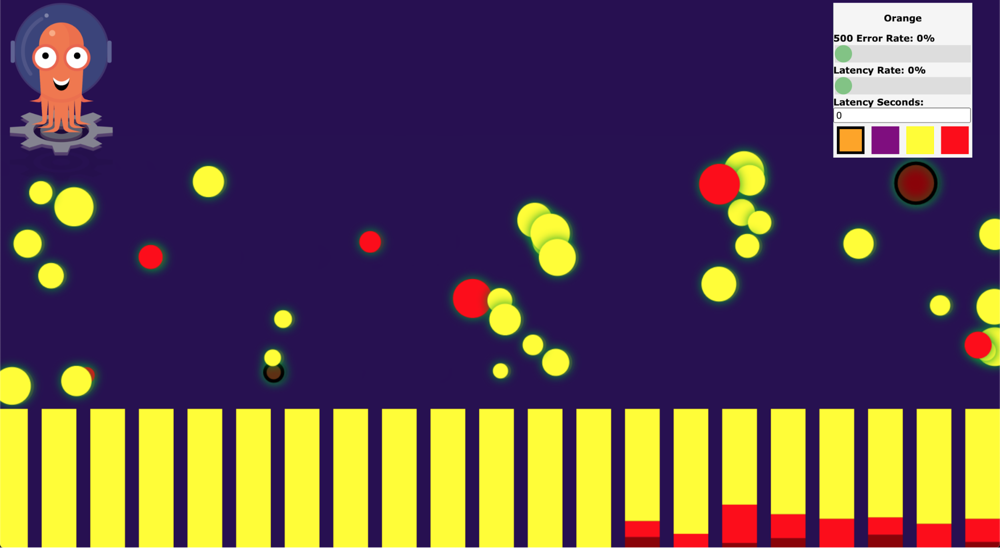

# ArgoCd + Argo Rollouts

## Objetivo

El Objetivo de este manual es explicar con una serie de ejemplos, cómo se implementan Canary Deployment  con ArgoCd y Argo Rollouts
Aunque Argo rollouts soporta BlueGreen y Canary deployment en estos ejemplo se centran en implementar Canary Deployment con istio y con ingress Nginx.

## Instalación

### ArgoCD

```shell
kubectl create namespace argocd
kubectl apply -n argocd -f https://raw.githubusercontent.com/argoproj/argo-cd/stable/manifests/install.yaml
```

Acceso a la interfaz web mapeando puertos

```shell
kubectl port-forward svc/argocd-server -n argocd 8080:443
```

Recuperamos el password inicial

```shell
kubectl get pods -n argocd -l app.kubernetes.io/name=argocd-server -o name | cut -d'/' -f 2
```

### ArgoRollouts

```shell
kubectl create namespace argo-rollouts
kubectl apply -n argo-rollouts -f https://raw.githubusercontent.com/argoproj/argo-rollouts/stable/manifests/install.yaml
```

Instalación del plugin de kubectl
Mac (Brew)

```shell
brew install argoproj/tap/kubectl-argo-rollouts
```

Manual

```shell
curl -LO https://github.com/argoproj/argo-rollouts/releases/latest/download/kubectl-argo-rollouts-darwin-amd64

chmod +x ./kubectl-argo-rollouts-darwin-amd64

sudo mv ./kubectl-argo-rollouts-darwin-amd64 /usr/local/bin/kubectl-argo-rollouts
```

Probamos que el plugin funciona

```shell
kubectl argo rollouts version
```

## Canary Deployment

### Introducción

Los ejemplos se basan en las aplicaciones configuradas en el siguiente repositorio de github <https://github.com/oillescas/argo-rollout-demo>

Argo Rollouts expande el concepto de ‘Deployment’ con el concepto de ‘Rollout’. Un rollout añade a un deployment,

- la configuración del tipo de deployment (Blue/Green o Canary) 
- La integración con un ingress controller o con un service mesh para el enrutamiento avanzado de tráfico
- La integración con proveedores de métricas como puede ser prometheus
- Y la configuración para el rollback o promoción automática de un deployment

Partiendo de esta base nos metemos en el código, lo ideal sería hacer un fork del repositorio y ir haciendo los merges de las ramas features en master para ir actualizando el cluster kubernetes con argoCD

### Nginx Ingress

Empezaremos creando la aplicación en argoCD mediante la aplicación web.


y sincronizamos la aplicación manualmente, con esto se desplegará la aplicación de ejemplo y lanzando el comando

```shell
kubectl argo rollouts get rollout rollouts-demo --watch
```

podremos monitorizar el estado de nuestro rollout


Una vez desplegado configurando el fichero /etc/hosts para que apunte a la ip del ingress el dominio <rollouts-demo.local> podremos ver la siguiente web


En esta web vemos la versión blue, de la aplicación de ejemplo y podremos jugar con la tasa de errores y la latencia de las peticiones, mientras la aplicación web representa las llamadas que hace con puntos del color de la versión que está desplegada.


En este primer despliegue inicial hemos desplegado un ingress, 2 Servicios (uno para la versión estable y otro para la versión canary), y Un Rollout.  En las distintas pruebas iré detallando el código del rollout.

#### Promoción manual de la release

En este punto vamos a aplicar una nueva versión de la aplicación de una manera manual para esto en el rollout definimos lo siguiente:

```yaml

strategy:  
  canary:                                      #Tipo de despliegue
    canaryService: rollouts-demo-canary        #Servicio para la versión canary
    stableService: rollouts-demo-stable        #Servicio para la versión estable
    trafficRouting:
      nginx:                                   #Tipo de enrutador este caso nginx
        stableIngress: rollouts-demo-stable
    steps:                                     #Pasos del despliegue,
    - setWeight: 5                             #Solo un paso con peso 5% al canary
    - pause: {}                                #Pausa indefinida
                                               #se continúa manualmente
```

Para empezar con las pruebas empezamos mergeando la rama feature/yellow en master, y cuando sincronicemos la aplicación en argoCD, nos desplegará un pod nuevo con la version yellow de la aplicación de ejemplo, con una carga del 5% balanceado por el ingress NGINX.

En la consola veremos que ya ha empezado el deploy y que está en estado parado, a la espera que hagamos una promoción manual.


y en la aplicación web veremos que se están recibiendo respuestas de la versión yellow.


Para terminar el despliegue necesitamos lanzar el siguiente comando

```shell
kubectl argo rollouts promote rollouts-demo
```

Ahora podemos ver como ha cambiado el rollout y que tenemos una nueva revisión y que la versión estable es la yellow


y en la web podemos ver como todas las llamadas pasan a ser amarillas


#### Despliegue automático

En este caso cambiamos el objeto rollout para pasar la versión de yellow a purple y cambiamos los steps para hacerlo de forma progresiva y automática.

```yaml
steps:
    - setWeight: 20            #Peso 20% al canary
    - pause: {duration: 10}    #Durante 10 segundos
    - setWeight: 40            #Peso al 40%
    - pause: {duration: 20}    #Durante 20 segundos
    - setWeight: 60            #Peso al 60%
    - pause: {duration: 40}    #Durante 40 segundos
    - setWeight: 80            #Peso al 80%
    - pause: {duration: 60}    #Durante 60 segundos
```

Y aplicamos de la misma manera, mergeamos la rama feature/purple-auto en master y sincronizamos en argoCD podemos ver tanto en la aplicación como en la consola el progreso de la release

| CLI  | WEB |
| ------------- | ------------- |
|   |   |
|   |   |
|   |   |

### Istio

Para comenzar con los ejemplos de istio es recomendable borrar la aplicación anterior en argoCD, mergear contra master la rama feature/istio y volver a crear la aplicación esta vez de la carpeta istio.

En este momento podemos monitorizar el rollout con el mismo comando

```shell
kubectl argo rollouts get rollout rollouts-demo --watch
```

En el ejemplo de istio se despliegan los siguientes elementos en el cluster

- Un Gateway Istio
- 2 Servicios (uno para la versión estable y otro para la versión canary)
- Un VirtualService de istio
- Un Rollout.

En este caso el rollout tiene la siguiente configuración.

```yaml
strategy:
  canary:
    canaryService: rollouts-demo-canary
    stableService: rollouts-demo-stable
    trafficRouting:
      istio:
        virtualService:
          name: rollouts-demo-vsvc
          routes:
           - primary 
    steps:
    - setWeight: 20
    - pause: {duration: 10}
    - setWeight: 40
    - pause: {duration: 10}
    - setWeight: 60
    - pause: {duration: 10}
    - setWeight: 80
    - pause: {duration: 10}
```

En comparación con la anterior solo cambia la configuración de istio respecto a la de NGINX

Para poder ver la aplicación web hay que actualizar la ip del /etc/hosts a el gateway de istio.

#### Despliegue automático con istio

Desde la rama feature/istio-purple mergeamos en master para lanzar el siguiente canary, y podemos comprobar desde la monitorización como va aumentando el balanceo cada 10 segundos, en este caso solo he cambiado la versión de orange a purple

| CLI  | WEB |
| ------------- | ------------- |
|   |   |

#### Despliegue automático con análisis de la canary

En la rama feature/istio-yellow he añadido la promoción o rollback de la release de manera automática con un nuevo objeto de kubernetes “AnalisisTemplate”

```yaml
apiVersion: argoproj.io/v1alpha1
kind: AnalysisTemplate
metadata:
name: success-rate
spec:
args:
- name: service-name
metrics:
- name: success-rate
  interval: 20s
  count: 3
  successCondition: result[0] >= 0.95
  failureLimit: 1
  provider:
    prometheus:
      address: http://10.152.183.97:9090
      query: |
        sum(irate(
          istio_requests_total{reporter="source",destination_service=~"{{args.service-name}}",response_code!~"5.*"}[5m]
        )) /
        sum(irate(
          istio_requests_total{reporter="source",destination_service=~"{{args.service-name}}"}[5m]
        ))
```

En este ejemplo usando prometheus como origen de los datos se comprueba que la estabilidad del servicio es mayor al 95% (respuestas distintas a 5XX) se recoge el dato 3 veces cada 20 segundos y se rechaza la métrica si una de esas mediciones es menor al 95%

Para realizar esta prueba es necesario cambiar la url del prometheus que recoge las métricas de istio.

En el objeto rollout se añade el análisis template en uno de los steps

```yaml
steps:
    - setWeight: 20
    - pause: {duration: 60}
    - analysis:
        templates:
        - templateName: success-rate
        args:
        - name: service-name
          value: rollouts-demo-canary.default.svc.cluster.local
    - setWeight: 40
    - pause: {duration: 20}
    - setWeight: 60
    - pause: {duration: 20}
    - setWeight: 80
    - pause: {duration: 30}
```

Junto con los parámetros de entrada, después de esperar 60 segundos en el 20% de carga en la canary ejecutamos el análisis junto a la subida al 40% de carga

En este ejemplo la release yellow es correcta y promociona correctamente

En la consola podemos ver como va realizando los chequeos

|   |   |
|---|---|

#### Despliegue erróneo con rollback automático

En la rama feature/istio-bad-red tenemos una configuración similar del AnalisysTemplate, pero en este caso vamos a desplegar al version ‘bad-red’ que es un pod que inserta errores aleatoriamente, así forzamos el error en el despliegue,

Al realizar el despliegue haciendo el merge y la sincronización con argoCD, en la aplicación web podemos ver llamadas erróneas aleatorias(puntos rojos oscurecidos) junto a las correctas (puntos rojos)

|   |   |
|---|---|

|   |   |
|---|---|

También podemos ver como cuando se hace el rollback dejan de llegar respuestas de la versión red

## Notas

- En estos ejercicios he intentado dar un enfoque técnico y práctico, por esto no me extiendo en las explicaciones de cómo funcionan los distintos componentes de argo rollouts, la documentación lo explica mucho mejor que yo
  - ArgoCD: https://argoproj.github.io/argo-cd/
  - Argo Rollouts: https://argoproj.github.io/argo-rollouts/
- No activo la sincronización automática en argoCD porque en el proceso de despliegue la aplicación no está sincronizada con el repositorio y se corre el riesgo de mal funcionamiento, lo ideal es configurar argoCD con los webhooks de github para que se lance la sincronización con los cambios en la rama que se sincroniza.
- En esta guia he recomendado hacer el merge en master para seguir el enfoque gitops pero argoCD también permite sincronizar los despliegues con distintas ramas, con lo que los ejemplos funcionan cambiado de rama en cada paso.
- Igualmente todos los ejemplos funcionan correctamente sin argoCD, clonando el repositorio y aplicando los cambios con kubectl